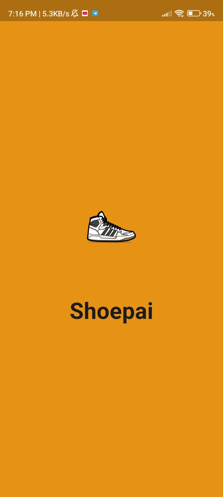
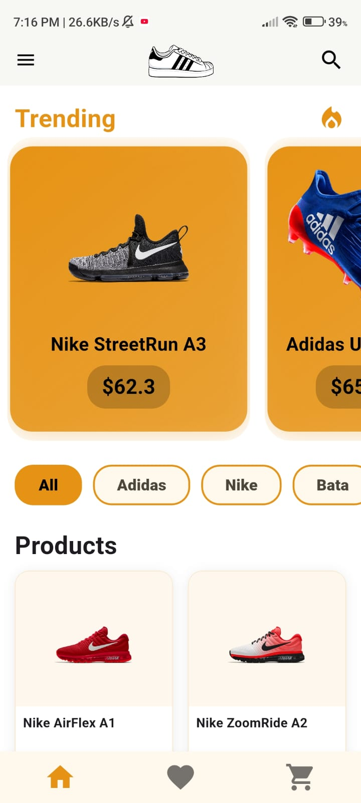
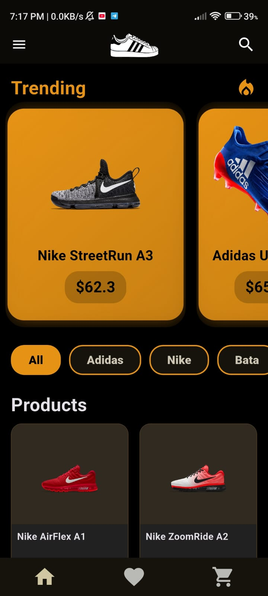
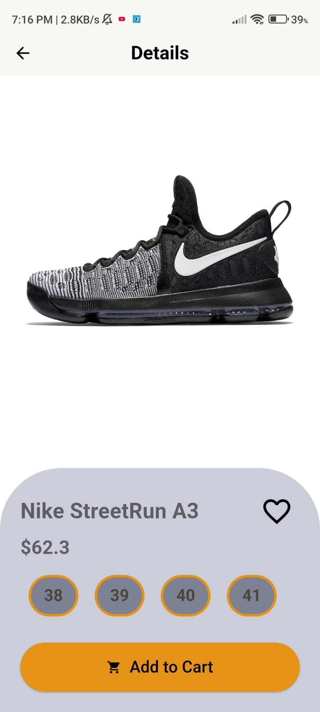
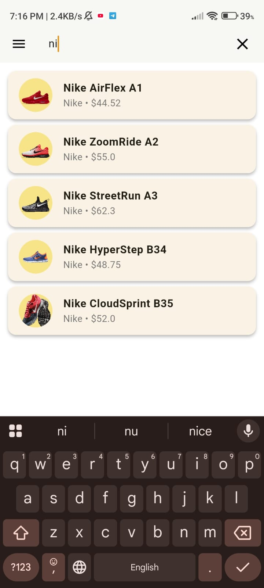

# 🛍️ Flutter Shop App

<div align="center">
  
  
  <p><em>A modern, cross-platform shoe store app built with Flutter</em></p>
  
  [](https://flutter.dev)
  [](https://dart.dev)
  [](https://pub.dev/packages/provider)
</div>

## 📱 App Demo

<div align="center">
  
</div>

## ✨ Features

### 🎯 Core Features
- **🏠 Product Catalog** - Browse through a wide variety of shoes from top brands
- **🔍 Smart Search** - Advanced search with suggestions and auto-complete
- **💝 Favorites** - Save products to your wishlist for later
- **🛒 Shopping Cart** - Add items, manage quantities, and review your order
- **👤 User Profile** - Editable profile with personal information
- **🎨 Theme Support** - Toggle between light and dark modes
- **📱 Responsive Design** - Optimized for both mobile and desktop

### 🏪 Brand Collections
- **Nike** - Premium athletic footwear
- **Adidas** - Sports and lifestyle shoes
- **Puma** - Performance and casual wear
- **Bata** - Comfortable everyday shoes
- **Lotto** - Sports and recreational footwear

### 🎭 UI/UX Features
- **🌟 Splash Animation** - Engaging Lottie animation on app start
- **🎨 Material 3 Design** - Modern Google Material Design
- **🌙 Dark/Light Mode** - Seamless theme switching
- **📐 Responsive Layout** - Adapts to different screen sizes
- **🔤 Google Fonts** - Beautiful Lato typography

## 📸 Screenshots

<div align="center">
  <table>
    <tr>
      <td align="center">
        
        <br><em>Splash Screen</em>
      </td>
      <td align="center">
        
        <br><em>Light Mode</em>
      </td>
      <td align="center">
        
        <br><em>Dark Mode</em>
      </td>
    </tr>
    <tr>
      <td align="center">
        
        <br><em>Product Details</em>
      </td>
      <td align="center">
        
        <br><em>Search & Suggestions</em>
      </td>
      <td align="center">
        
        <br><em>App Icon</em>
      </td>
    </tr>
  </table>
</div>

## 🚀 Getting Started

### Prerequisites
- Flutter SDK (3.9.0 or later)
- Dart SDK
- Android Studio / VS Code
- Android/iOS device or emulator

### Installation

1. **Clone the repository**
   ```bash
   git clone https://github.com/yourusername/shop_app_flutter.git
   cd shop_app_flutter
   ```

2. **Install dependencies**
   ```bash
   flutter pub get
   ```

3. **Run the app**
   ```bash
   flutter run
   ```

## 🏗️ Project Structure

```
lib/
├── main.dart                 # App entry point
├── global_variable.dart      # Global constants and data
├── pages/                    # UI screens
│   ├── splash_screen.dart    # Animated splash screen
│   ├── home_page.dart        # Main product listing
│   ├── product_details_page.dart # Product detail view
│   ├── cart_page.dart        # Shopping cart
│   ├── favourite_page.dart   # Favorites list
│   └── profile.dart          # User profile
├── providers/                # State management
│   ├── cart_provider.dart    # Cart state management
│   ├── favorite_provider.dart# Favorites state
│   ├── search_provider.dart  # Search functionality
│   └── theme_provider.dart   # Theme switching
└── widgets/                  # Reusable components
    └── product_list.dart     # Product grid/list widget

assets/
├── animations/               # Lottie animations
├── images/                   # Product images & logos
│   ├── Nike/                 # Nike shoe collection
│   ├── adidas/              # Adidas shoe collection
│   ├── Bata/                # Bata shoe collection
│   ├── puma/                # Puma shoe collection
│   ├── lotto/               # Lotto shoe collection
│   └── logo/                # Brand logos
└── screenshot/              # App screenshots & demo
```

## 🛠️ Dependencies

| Package | Version | Purpose |
|---------|---------|---------|
| **flutter** | SDK | Core framework |
| **provider** | ^6.1.5 | State management |
| **google_fonts** | ^6.3.1 | Typography (Lato font) |
| **lottie** | latest | Splash screen animation |
| **gap** | ^3.0.0 | Spacing widgets |
| **cupertino_icons** | ^1.0.8 | iOS-style icons |
| **flutter_launcher_icons** | ^0.13.1 | Custom app icon |

## 🎨 Design System

### Color Palette
- **Primary**: `#E69315` (Orange)
- **Secondary**: `#E3C502` (Golden Yellow)
- **Background Light**: `#FFFFFF`
- **Background Dark**: `#000000`

### Typography
- **Font Family**: Lato (Google Fonts)
- **Weight**: Regular, Bold
- **Size**: Responsive scaling

## 🔄 State Management

The app uses **Provider** pattern for state management:

- **CartProvider**: Manages shopping cart items and quantities
- **FavoriteProvider**: Handles favorite products list
- **ThemeProvider**: Controls dark/light theme switching
- **SearchProvider**: Manages search functionality and suggestions

## 🚀 Future Enhancements

### 🔐 Authentication & User Management
- [ ] User registration and login
- [ ] Google/Facebook social authentication
- [ ] Password reset functionality
- [ ] User profile picture upload

### 💾 Data Persistence
- [ ] Local storage with SQLite/Hive
- [ ] Cloud synchronization
- [ ] Offline mode support
- [ ] Cart persistence across sessions

### 🌐 Backend Integration
- [ ] Firebase integration
- [ ] RESTful API connectivity
- [ ] Real-time inventory updates
- [ ] Push notifications

### 💳 E-commerce Features
- [ ] Payment gateway integration (Stripe/PayPal)
- [ ] Order tracking system
- [ ] Order history
- [ ] Checkout flow with address management
- [ ] Discount codes and coupons
- [ ] Product reviews and ratings

### 🔍 Enhanced Search & Discovery
- [ ] Voice search functionality
- [ ] Barcode/QR code scanning
- [ ] AI-powered product recommendations
- [ ] Advanced filtering (price, brand, size, color)
- [ ] Recently viewed products

### 📱 Platform & Performance
- [ ] iOS-specific optimizations
- [ ] Web platform support
- [ ] Progressive Web App (PWA)
- [ ] Performance monitoring
- [ ] Analytics integration

### 🎨 UI/UX Improvements
- [ ] Smooth page transitions
- [ ] Skeleton loading screens
- [ ] Pull-to-refresh functionality
- [ ] Haptic feedback
- [ ] Accessibility improvements
- [ ] Multi-language support

### 🧪 Testing & Quality
- [ ] Unit tests for providers
- [ ] Widget tests for UI components
- [ ] Integration tests for user flows
- [ ] Performance testing
- [ ] Code coverage reports

## 🤝 Contributing

Contributions are welcome! Please feel free to submit a Pull Request. For major changes, please open an issue first to discuss what you would like to change.

1. Fork the Project
2. Create your Feature Branch (`git checkout -b feature/AmazingFeature`)
3. Commit your Changes (`git commit -m 'Add some AmazingFeature'`)
4. Push to the Branch (`git push origin feature/AmazingFeature`)
5. Open a Pull Request

## 📄 License

This project is licensed under the MIT License - see the [LICENSE](LICENSE) file for details.

## 👨‍💻 Author

**Your Name**
- GitHub: [@yourusername](https://github.com/yourusername)
- LinkedIn: [Your LinkedIn](https://linkedin.com/in/yourprofile)

## 🙏 Acknowledgments

- [Flutter Team](https://flutter.dev) for the amazing framework
- [Material Design](https://material.io) for design guidelines
- [Lottie](https://lottiefiles.com) for beautiful animations
- [Google Fonts](https://fonts.google.com) for typography

---

<div align="center">
  <p>Made with ❤️ using Flutter</p>
  
</div>